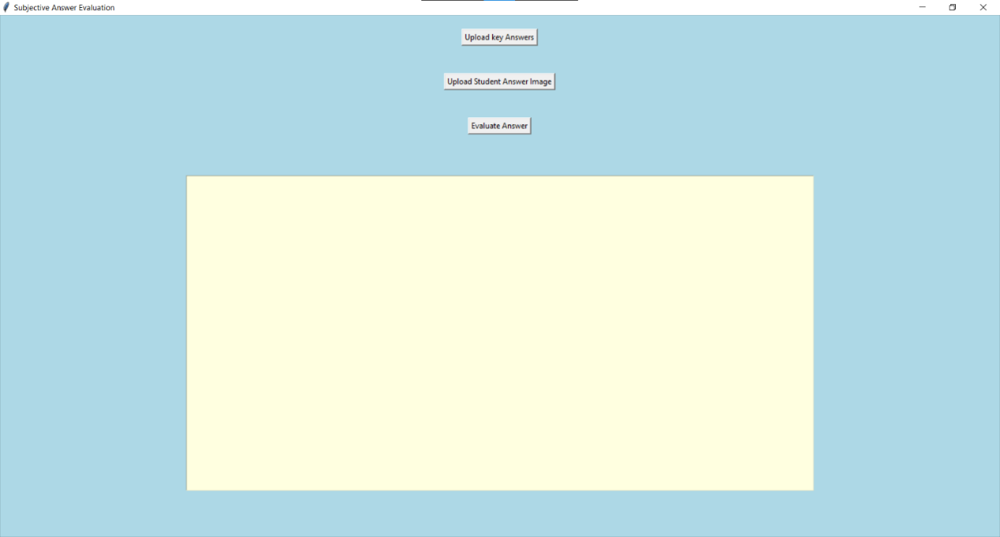

# 📝 Subjective Answer Evaluation System

## 📌 Project Overview

This project implements an **automated evaluation system for handwritten subjective answers**, developed as part of academic coursework to streamline manual grading by comparing student answers with predefined key answers and generating an accuracy assessment.

---

## 💡 Problem Statement

Traditional subjective answer evaluation is manual, time-consuming, and prone to human bias. Teachers spend hours reading and comparing handwritten answers against the key. This system aims to **digitize and automate the evaluation process**, ensuring consistency and faster grading.

---

## 🎯 Solution

### **Key Features:**

✔️ **Handwritten Answer Recognition**  
Uses **Google Cloud Vision API** to extract text from scanned handwritten answer images.

✔️ **Natural Language Processing Evaluation**  
Compares extracted text with key answers using NLP techniques to compute **similarity scores**.

✔️ **Accuracy Assessment**  
Generates an **accuracy percentage** representing how closely the student's answer matches the expected key answer.

---

## 🔧 Tech Stack

- **Programming Language:** Python
- **APIs & Libraries:** Google Cloud Vision API, NLP libraries (`nltk`), `pandas`, `numpy`
- **Other Tools:** Batch script for execution (`run.bat`)

---

## 🚀 Installation & Setup

1. **Clone this repository:**

```bash
git clone https://github.com/vijay-atla/subjective-answer-evaluation.git

```

2. **Navigate to the project directory:**

```bash
cd subjective-answer-evaluation/

```

3. **Install dependencies:**

```bash
pip install -r requirements.txt
```

4. **Set up Google Cloud Vision credentials:**

- Create a Google Cloud project.

- Enable the Vision API.

- Download credentials.json and set your environment variable:

```bash
export GOOGLE_APPLICATION_CREDENTIALS="path/to/credentials.json"

```
- For Windows PowerShell:
```bash
setx GOOGLE_APPLICATION_CREDENTIALS "path\to\credentials.json"
```

5. **Run the application:**

```bash

python Subjective.py

```

- Alternatively, you can run the batch execution file:

```bash
run.bat
```

---

## 📸 Screenshots




---

## 👤 Author

- Vijay Atla

Graduate Student, MSIS

Central Michigan University

## 📝 License

- This project was developed for educational purposes. Feel free to fork and customize for learning, research, and academic demonstrations.

